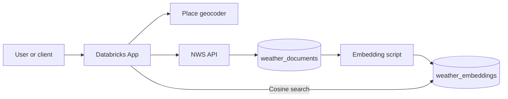
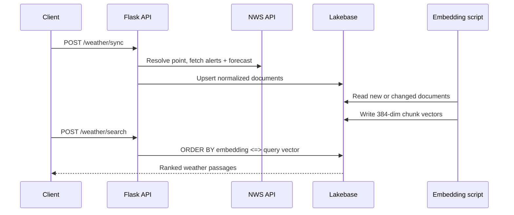
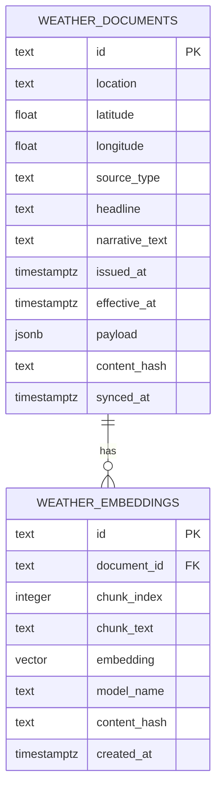

# Weather Intelligence with Lakebase Vector Search

Weather Intelligence is a Databricks App that turns National Weather Service alerts and forecast narratives into semantically searchable documents. It harvests live text, preserves the raw JSON in Lakebase PostgreSQL, chunks and embeds the narratives with a 384-dimensional sentence-transformer model, and retrieves relevant passages using pgvector cosine similarity.

A search such as “flash flood risk this weekend” can match related warning and forecast language even when the source text does not contain the exact same words.

## Features

- Accepts U.S. city/state names, `latitude,longitude` strings, or coordinate objects
- Resolves place names to coordinates without requiring an API key
- Fetches point-specific active alerts and multi-day detailed forecasts from NWS
- Normalizes unstructured narratives into a consistent document schema
- Stores raw source JSON for provenance and troubleshooting
- Uses stable IDs and PostgreSQL upserts to prevent duplicate sync records
- Chunks text with 800-character windows and 100-character overlap
- Embeds chunks with `sentence-transformers/all-MiniLM-L6-v2`
- Stores vectors in a typed `VECTOR(384)` column
- Uses an HNSW index with `vector_cosine_ops`
- Re-embeds changed forecasts using a content hash
- Supports semantic search with optional alert/forecast filtering
- Includes validation for empty queries, sync limits, and `top_k` bounds
- Provides both REST endpoints and a responsive Databricks App interface

## Architecture



The Open-Meteo geocoder is used only to turn a city name into coordinates. National Weather Service endpoints remain the sole source of weather alerts and forecast narratives.

## Pipeline



## Data model



`weather_embeddings.document_id` references `weather_documents.id` with `ON DELETE CASCADE`. A unique constraint on `(document_id, chunk_index)` makes the embedding job safely repeatable.

## Technology

| Layer | Technology | Purpose |
| --- | --- | --- |
| Application | Flask + Databricks Apps | REST API and browser interface |
| Weather source | National Weather Service API | Alerts and detailed forecast narratives |
| Place lookup | Open-Meteo Geocoding API | City/state to latitude/longitude resolution |
| Operational store | Databricks Lakebase | Documents, JSON provenance, and vectors |
| Vector engine | PostgreSQL pgvector | Typed vectors, HNSW index, cosine retrieval |
| Embedding model | all-MiniLM-L6-v2 | Local 384-dimensional sentence embeddings |
| Database access | psycopg2 | Parameterized reads and batched writes |

## Repository structure

```text
.
├── app.py                                  # Flask UI, sync, stats, and search routes
├── app.yaml                                # Databricks Apps runtime configuration
├── embedding_model.py                      # Model singleton, chunking, vector formatting
├── lakebase.py                             # Secret resolution, connection, and DDL
├── weather_client.py                       # Geocoding, NWS requests, normalization
├── weather_store.py                        # Shared psycopg2 document upserts
├── setup_secrets.py                        # Hidden Lakebase URL prompt
├── requirements.txt                        # Runtime dependencies
├── notebooks/
│   └── ingest_weather_embeddings.ipynb     # Complete sync → embed → verify workflow
├── scripts/
│   ├── __init__.py                          # Makes ingestion helpers importable
│   └── ingest_weather_embeddings.py        # Command-line embedding alternative
├── sql/
│   ├── 01_setup_weather_vector_schema.sql  # Manual schema option
│   └── 02_verify_weather_pipeline.sql      # Verification and screenshot queries
├── static/
│   └── styles.css                          # Responsive interface styles
├── templates/
│   └── index.html                          # Sync and search interface
└── tests/
    └── test_weather_pipeline.py             # Chunking and normalization tests
```

## Why the National Weather Service?

The National Weather Service API is free, does not require an API key, and publishes rich narrative fields such as alert descriptions, safety instructions, and `detailedForecast` text. These passages are well suited to semantic retrieval because users often describe a risk differently from the source wording. The stored `payload` preserves the original API response, while normalized columns make filtering and inspection straightforward.

NWS requires a descriptive `User-Agent`. Set `NWS_USER_AGENT` in `app.yaml` to identify your project or GitHub account before deployment.

## Lakebase schema decisions

- **Documents and vectors are separate.** Raw records remain easy to audit and can be re-embedded without fetching the source again.
- **Stable document IDs** are SHA-256 hashes of source identity, location, and effective period, enabling idempotent upserts.
- **Content hashes** detect changed narratives so the ingestion script replaces stale embeddings.
- **Chunk size is 800 characters with 100 characters of overlap.** Most NWS forecasts fit into one chunk; longer warning instructions retain context across boundaries.
- **Embedding dimension is 384**, matching `sentence-transformers/all-MiniLM-L6-v2` and the `VECTOR(384)` schema.
- **Normalized embeddings plus cosine distance** support the pgvector `<=>` operator. Similarity is returned as `1 - cosine_distance`.
- **HNSW** is used because it provides fast approximate cosine search without requiring a training step.

## Configure Lakebase

The project expects the working Databricks secret used by the application to be:

| Setting | Value |
| --- | --- |
| Secret scope | `database` |
| Secret key | `lakebase-url` |

If that secret already exists and works, reuse it. Otherwise, from an authenticated Databricks terminal run:

```bash
python setup_secrets.py
```

Paste the complete Lakebase PostgreSQL URL at the hidden prompt. Never commit it to this repository.

Before deployment:

1. Confirm the Lakebase role has permission to connect and create objects in the selected database/schema.
2. On the Databricks App **Authorization** page, add `database/lakebase-url` with **Can read** permission.
3. Select or grant the working Lakebase role/resource permission for the app identity.

The app calls `ensure_weather_schema()` at startup. You can instead run `sql/01_setup_weather_vector_schema.sql` manually as a database owner.

## Recommended Databricks workflow

This order lets you validate every Lakebase and vector-search step before publishing the App:

1. Push this repository to GitHub.
2. Create a Databricks Git folder connected to the repository.
3. Configure the working `database/lakebase-url` secret and Lakebase role permissions.
4. Run `sql/01_setup_weather_vector_schema.sql` in the Lakebase SQL editor.
5. Open `notebooks/ingest_weather_embeddings.ipynb` from the Git folder, attach compute, and select **Run all**.
6. Confirm every notebook section succeeds, including the semantic-search smoke test.
7. Inspect `weather_documents` and `weather_embeddings` manually and run `sql/02_verify_weather_pipeline.sql`.
8. Create a Custom Databricks App from the same repository root.
9. Add the secret and Lakebase role/resource permissions on the App **Authorization** page.
10. Deploy and confirm `GET /healthz` returns `{"status": "ok"}`.
11. Open the App UI and test sync, statistics, and semantic search.

## Run the complete notebook pipeline

Open:

```text
notebooks/ingest_weather_embeddings.ipynb
```

The notebook mirrors the operational sequence used by the deployed application while giving you visible outputs for each stage:

1. Installs the notebook dependencies and restarts Python.
2. Creates configurable widgets for locations, limits, chunking, batching, and a test query.
3. Connects to Lakebase and confirms pgvector.
4. Resolves locations, fetches NWS alerts and forecasts, and upserts `weather_documents`.
5. Selects documents that are new or whose content changed.
6. Chunks and embeds narratives with `all-MiniLM-L6-v2`.
7. Writes vectors through psycopg2 using `%s::vector`.
8. Verifies document counts, vector dimensions, and foreign-key integrity.
9. Runs a cosine-similarity search before you deploy the App.

The default widget locations are Chicago and Austin. Change the semicolon-separated `locations` widget to test other U.S. cities or coordinate pairs.

### Command-line alternative

The notebook reuses functions from the plain Python script. After documents exist, you can run the embedding stage without a notebook:

```bash
pip install -r requirements.txt
python scripts/ingest_weather_embeddings.py
```

## Use the deployed App

### 1. Sync additional weather documents

Use the Step 1 panel in the browser or call:

```bash
curl -X POST "$APP_URL/weather/sync" \
  -H "Content-Type: application/json" \
  -d '{"locations":["Chicago, IL","Austin, TX"],"limit":50}'
```

Coordinate inputs also work:

```json
{
  "locations": [
    "41.8781,-87.6298",
    {"label": "Austin, TX", "latitude": 30.2672, "longitude": -97.7431}
  ],
  "limit": 50
}
```

The response reports documents synced per location and any location-specific errors. Repeating the request updates existing records instead of producing duplicates. After adding new documents through the App, rerun the notebook so Step 2 creates their embeddings.

### 2. Generate embeddings

The middle UI panel identifies the notebook used for this stage. Open `notebooks/ingest_weather_embeddings.ipynb` in the Git folder and run it after every later sync. The content-hash check skips unchanged documents.

### 3. Search semantically

```bash
curl -X POST "$APP_URL/weather/search" \
  -H "Content-Type: application/json" \
  -d '{"query":"risk of flooding near rivers","top_k":5}'
```

Filter to alerts or forecasts:

```bash
curl -X POST "$APP_URL/weather/search" \
  -H "Content-Type: application/json" \
  -d '{"query":"dangerous heat overnight","top_k":5,"source_type":"alert"}'
```

The endpoint clamps `top_k` to 1–20 and returns HTTP 409 with instructions when the embeddings table is empty.

## API reference

| Method | Endpoint | Description |
| --- | --- | --- |
| `GET` | `/healthz` | App health and embedding model |
| `GET` | `/weather/stats` | Document, embedding, and location counts |
| `POST` | `/weather/sync` | Harvest and upsert alerts and forecasts |
| `POST` | `/weather/search` | Semantic vector retrieval |
| `GET` | `/weather/search?query=...` | Query-string variant returning ranked matches |

## Verify the result

Run `sql/02_verify_weather_pipeline.sql` in a Lakebase SQL editor. It confirms:

- Document counts by location and source type
- Zero orphaned embedding rows
- Document-to-embedding coverage
- 384-dimensional stored vectors
- HNSW index creation
- Primary, unique, check, and foreign-key constraints

Useful quick checks:

```sql
SELECT location, source_type, headline, synced_at
FROM weather_documents
ORDER BY synced_at DESC
LIMIT 20;

SELECT vector_dims(embedding) AS dimensions, COUNT(*)
FROM weather_embeddings
GROUP BY vector_dims(embedding);
```

## Run tests

```bash
python -m unittest discover -s tests -v
```

The tests do not call external services or require a Lakebase connection.

## Security

- No database URL or API credential is stored in source control.
- SQL values are passed through psycopg2 parameters or `execute_values`.
- Table names are fixed in code rather than accepted from requests.
- Raw upstream JSON is stored for provenance but is not rendered as HTML.
- The browser interface escapes retrieved text before inserting it into the page.
- Sync locations, query length, document limits, and `top_k` are bounded.

## Known limitations and future improvements

- The free geocoder can return an unexpected place when a city name is ambiguous; coordinates provide deterministic input.
- NWS covers the United States and associated territories rather than worldwide weather.
- Active alerts are transient, so periodic sync is necessary to maintain fresh coverage.
- The first embedding-model download can take longer than later runs.
- Current ingestion is a manually run Databricks notebook; a scheduled Databricks Workflow would be the next operational improvement.
- Search returns source passages but does not yet generate an LLM summary.
- A production version should add retry/backoff, model artifact caching, pagination, and monitoring.

## License

No license has been selected. Add a license before redistributing the project or accepting external contributions.
